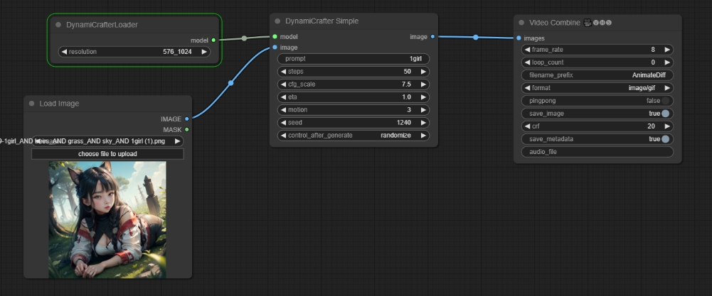
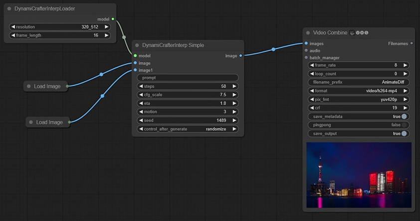

ComfyUI DynamiCrafter

[DynamiCrafter](https://github.com/Doubiiu/DynamiCrafter)

注意一定要安装xformers `pip install xformers`

默认自动下载模型，但中国用户下载模型参考https://hf-mirror.com/

```
pip install -U huggingface_hub
export HF_ENDPOINT=https://hf-mirror.com  windows上在powershell里$env:HF_ENDPOINT = "https://hf-mirror.com"
huggingface-cli download --resume-download laion/CLIP-ViT-H-14-laion2B-s32B-b79K
```

下载model.ckpt到models/checkpoints/dynamicrafter_512_interp_v1/model.ckpt

https://hf-mirror.com/Doubiiu/DynamiCrafter_512_Interp

下载model.ckpt到models/checkpoints/dynamicrafter_1024_v1/model.ckpt

https://hf-mirror.com/Doubiiu/DynamiCrafter_1024


## Examples

### base workflow



https://github.com/chaojie/ComfyUI-DynamiCrafter/blob/main/workflow.json

prompt: 1girl


prompt: 1girl sleeping


4090 test:

16 frame length takes 3 minutes

32 frame length takes 6 minutes (32设置是在Loader节点)


### interpolation workflow



https://github.com/chaojie/ComfyUI-DynamiCrafter/blob/main/wf-interp.json